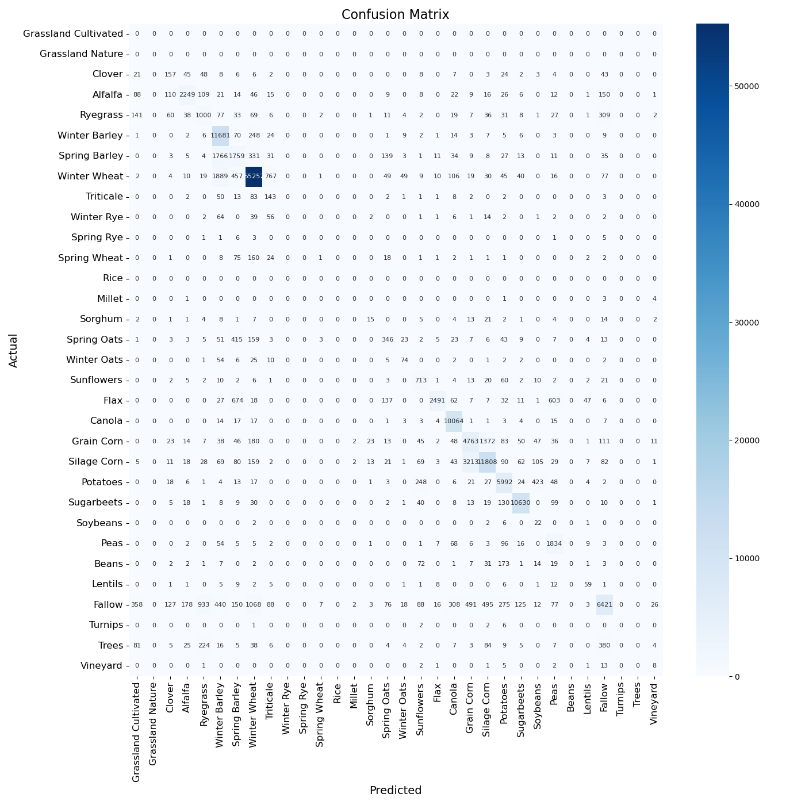

# Crop Doctor :man_health_worker:

Key Features:

:corn: Performs crop model performance analysis

:mechanical_arm: Provides automated pipeline tooling for extracting underperforming fields

## Setup & Use

1. Build Docker image from Dockerfile:

`docker build -t crop-mle .`

2. Run the docker container:

`docker run -v /path/to/your/data:/data -e PYTHONPATH=/app -it crop-mle bash`

**ensure that `path/to/your/data` directory contains the two datasets that you need to download: [ml_2021-08-01_2022-12-31_u0c.tif](https://drive.google.com/file/d/1R_4NtTIUrQHo7cGA-Xi26KvUh3RYjLa3/view?usp=drive_link) and [u0c_gt_filtered_2022.gpkg](https://drive.google.com/file/d/1uOM9DlyNp4V2dNtW_cSt8VLvTRSzlGn6/view?usp=drive_link)**

3. From here you can:

* run in `analysis` mode to conduct performance analysis:

`python crop_mle/main.py --gt /data/u0c_gt_filtered_2022.gpkg --raster /data/ml_2021-08-01_2022-12-31_u0c.tif --label_field normalized_label --mode analysis`

* run in `select` mode to select export underperforming fields from `u0c` using our underperformance ruleset:

`python crop_mle/main.py --gt /data/u0c_gt_filtered_2022.gpkg --raster /data/ml_2021-08-01_2022-12-31_u0c.tif --label_field normalized_label --mode analysis`

## Implementation Notes

This tool utilizes `multiprocessing` and vectorized `pandas` operations for efficient raster to vector field-level aggregations and analysis of large tabular datasets. We also use `dataclass` as a clean way to store and load the provided (and any other future hypothetical) label dictionary. As a qualitative efficiency benchmark, a machine with 20 cores & 64GB RAM runs both processing tools in under 2 minutes each for the ~150k record fields dataset.

### Some Gotcha's
To ensure crop types are At some point, I discovered that two fields in the ground truth dataset had 'normalized_label':'radish' which wasn't in provided data dictionary. So I implemented a [`schema_check`](/crop_mle/load_data.py) to check for non-conforming field values and removing those records at the outset.

I also discovered through some [rasterio.mask.mask](https://rasterio.readthedocs.io/en/stable/api/rasterio.mask.html) debugging that there are about ~170 fields that are so small that the default behavior was not even grabbing one valid pixel. Those are removed from analysis by setting a nodata value for the masking and removing those nodata values before doing the field-level prediction aggregation.

## Diagnosis

Looking by F1 scores and Agreement % first, we see that there are 6 crop types in ground truth with 0 F1 and 0% agreement: Winter Rye, Spring Rye, Millet, Beans, Turnips, and Trees. 

| Crop Type   | Counts |
|-------------|--------|
| Winter Rye  | 193    |
| Spring Rye  | 17     |
| Millet      | 9      |
| Beans       | 336    |
| Turnips     | 11     |
| Trees       | 909    |
| Total Count | 1475   |

These are crop types that the model made either no predictions for or predicted that crop type but was wrong in all instances (e.g. Millet). While these are minority classes by a long shot - representing 
0.96% of ground truth dataset - it is worth considering grabbing all of these fields for next training round as they do not imply much from a training overhead stand-point and nobody loves to see a 0.0 F1 score or Agreement.

Next up are crop types with an F1 and/or agreement above 0.0 and below 0.5: 

| Crop Type      | Counts |
|----------------|--------|
| Ryegrass       | 1885   |
| Lentils        | 112    |
| Spring Barley  | 4190   |
| Winter Oats    | 184    |
| Spring Oats    | 1131   |
| Clover         | 387    |
| Triticale      | 311    |
| Sorghum        | 105    |
| Vineyard       | 34     |
| Soybeans       | 33     |
| Spring Wheat   | 298    |
| Total Count    | 8670   |

In total, this subset of ground truth data represents about 5.6% of the total ground truth dataset so again these are minority classes and in the same vein as the above group, it is certainly worth re-training with all of these as well from the same reasoning as the above group - any gains in improvement you get from retraining should not be costly from a training overhead perspective. Interpreting 'what's good enough' is more to do with knowing the business use case, so I am making a broad assumption here that F1's below 0.5 are of concern regardless of model confidence in these predictions.

Depending on the business interpretation of 'good enough' like I mentioned above, we could stop here if the opportunity cost for retraining on crops that are already above the 0.5 F1 mark are too high. But for sake of exercise, here's the top half (F1 > 0.5) of the performance dataset. We will now look at the whole picture of F1, confidence, count of fields, and percent agreement to make some decisions and be a little more discerning.

| Crop           | F1   | Average Confidence | Count | Percent Agreement |
|----------------|------|--------------------|-------|-------------------|
| Sugarbeets     | 0.96 | 77.03              | 11024 | 96.43             |
| Canola         | 0.96 | 78.29              | 10154 | 99.11             |
| Winter Wheat   | 0.95 | 67.16              | 58851 | 93.88             |
| Potatoes       | 0.85 | 65.8               | 6858  | 87.37             |
| Winter Barley  | 0.82 | 67.55              | 12092 | 96.6              |
| Alfalfa        | 0.81 | 59.86              | 2912  | 77.23             |
| Silage Corn    | 0.79 | 51.33              | 15921 | 74.17             |
| Flax           | 0.75 | 53.58              | 4123  | 60.42             |
| Peas           | 0.74 | 57.01              | 2112  | 86.84             |
| Fallow         | 0.66 | 42.43              | 11785 | 54.48             |

In the group of crop types where 0.5 > F1 < 0.75, there are three crop types: Flax, Peas, and Fallow. Flax and Fallow are the weaker 2 of this group assessed by F1, Model Confidence, and Percent Agreement. Peas, like Flax and Fallow, had F1 <= 0.75 but its average confidence and percent agreement were much higher relatively. Looking at the confusion matrix now, it appears that the largest proportion of Pea's False positives and Flax's False positives were actually Flax (603) and Fallow (16) in ground truth respectively. So we have some considerable confusion among these three crop types that would be good argument to re-train with all three of these crop types to reduce interclass confusion among the bottom 3 of our top-performers.

In summary, I recommend to include all fields for these 20 (of 27 represented) crop types from `u0c` AOI:

| Crop Type   | Counts |
|-------------|--------|
| Winter Rye     | 193    |
| Spring Rye     | 17     |
| Millet         | 9      |
| Beans          | 336    |
| Turnips        | 11     |
| Trees          | 909    |
| Ryegrass       | 1885   |
| Lentils        | 112    |
| Spring Barley  | 4190   |
| Winter Oats    | 184    |
| Spring Oats    | 1131   |
| Clover         | 387    |
| Triticale      | 311    |
| Sorghum        | 105    |
| Vineyard       | 34     |
| Soybeans       | 33     |
| Spring Wheat   | 298    |
| Flax           | 4123   |
| Peas           | 2112   |
| Fallow         | 11785  |
| Total Count    | 35,959 |

This represents 23.3% of the total ground truth dataset and incorporates all crop types where performance was deemed sub-optimal according to F1, Agreement %, and Average Confidence.

